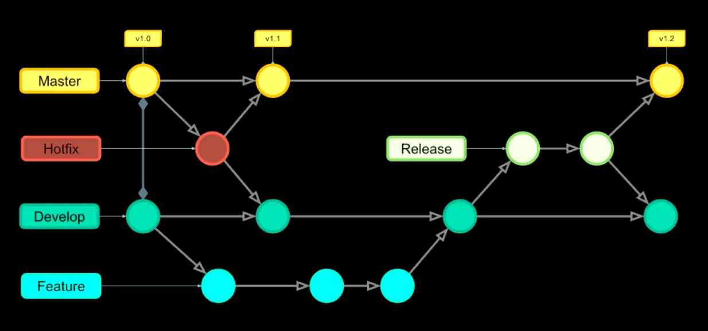
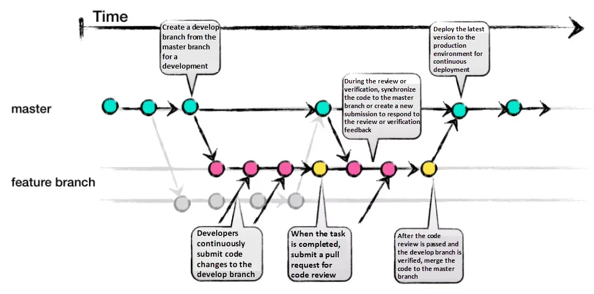

## 1-1. Git이란?

- 원하는 시점마다 깃발을 꽂고 깃발이 꽂힌 시점으로 자유롭게 이동 가능한 소스 코드 버전 관리 시스템.

## 1-2. Git의 기능

<details>
<summary>기능</summary>
<br>
- 버전관리 > 파일의 변경 이력을 기록하고, 불필요한 경우 이전 버전으로 되돌릴 수 있다.
<br>
<br>
- 브랜치 > 개발의 다양한 단계나 기능을 분리하여 관리할 수 있다.
<br>
이를 통해 여러 기능을 동시에 개발하고 통합하는 것이 용이하다.
<br>
<br>
- 협업 > 여러 개발자가 동일한 프로젝트에서 병렬로 작업할 수 있게 지원한다.
</details>

## 2-1. GitHub란?

- Git 호스팅 사이트 중 하나. 누구든지 기여할 수 있는 공개 저장소 프로젝트 > 오픈소스

## 2-2. GitHub의 기능

<details>
<summary>기능</summary>
<br>
- 저장소 호스팅 > 프로젝트의 소스 코드를 온라인에 저장하고 관리할 수 있다.
<br>
<br>
- Pull Request 및 Issue Tracking > 개발자들이 코드 변경 사항을 검토하고 통합하기 위한 매커니즘을 제공하며,
버그나 개선 사항을 추적할 수 있는 시스템을 제공한다.
<br>
<br>
- 문서화 및 위키 > 프로젝트 관련 문서와 정보를 저장하고 공유할 수 있는 위키 기능을 제공한다.
</details>

## 3-1. 전역 설정 값 입력

```bash

$ git config --global user.email "userEmail"
# 사용자의 이메일을 광역으로 설정하겠다.
$ git config --global user.name "userName"
# 사용자의 이름을 광역으로 설정하겠다.

$ git config --get user.email
# 사용자의 이메일 정보 조회
$ git config --get user.name
# 사용자의 이름 정보 조회

$ git config --global init.defaultBranch main
# 광역으로 초기 브랜치 값을 main으로 설정하겠다.

$ git config --get init.defaultBranch
# 초기 브랜치 정보 조회

$ git init
# 초기값 세팅

```

## 3-2. 로컬 저장소에 commit 만들기

```bash

#1. 커밋에 추가할 파일 선택
$ git add README.txt

#2. 커밋에 상세 설명(first commit)을 적어 커밋
$ git commit -m "first commit"

#3. 변경 상태 확인
$ git status  # 작업 트리 상태 출력

$ git diff  # 변경 사항 확인

#4. 수정 된 파일 commit을 위해 추가 후 두번째 커밋하기
$ git add README.txt  # 특정 파일만 인덱스에 등록

$ git add -u  # 변경한 파일을 전부 인덱스에 등록 (변경한 기존 파일만 등록)

$ git add -A  # 모든 파일을 인덱스에 등록 (새로 작성한 파일까지 등록)
#or
$ git add .

$ git commit -m "updated" # updated라는 상세 설명으로 커밋

```

## 3-3. 로컬 저장소의 다른 커밋으로 이동

```bash

#1. 커밋 확인
$ git log # 변경 이력 확인

$ git log -p  # 변경 이력과 함께 차이점 표시 (끌 때는 q)

#2. 이전 커밋과의 차이 확인
$ git diff "커밋아이디"

#3. first commit의 앞 7자리 아이디를 복사 후 checkout명령어로 해당 커밋으로 되돌림
$ git checkout "커밋아이디"

#4. 다시 최신 커밋으로 돌아가기
$ git checkout -

```

## 4-1. 원격 저장소에서 로컬 저장소로 커밋 내보내기

```bash

#1. 로컬 저장소에 원격 저장소 주소 설정
$ git remote add origin "https://github.com/유저아이디/원격저장소이름.git"

#2. push를 이용해 로컬 저장소의 commit 원격 저장소로 내보냄
$ git push origin main

#3. 원격 저장소 삭제
$ git remote rm origin

```

## 4-2. 원격 저장소의 커밋 로컬로 받기

```bash

#1. clone으로 원격 저장소 통채로 로컬의 특정 경로에 복제
$ git clone "https://github.com/유저아이디/원격저장소이름.git"

```

## 4-3. 변경사항 다시 원격 저장소에 내보내기

```bash

$ git add README.txt
$ git commit -m "third commit"
$ git push origin main

```

## 5-1. 용어

<details>
<summary>전반적인 용어</summary>
<br>
- Project Source Code(Working Directory안에 존재) > 소스코드가 있는 프로그램 작성 파일로 일반적으로 workspace에 해당하는 디렉토리 안에 작성한다.
<br>
<br>
- Staging Area(=Index Area) > 커밋 할 것들을 담아놓는 임시 공간, 커밋 하나에 포함할 변경 사항을 선택할 수 있기 위함
<br>
<br>
- Local Repo (=지역 저장소, .git directory) > 프로그래머가 프로젝트 소스코드를 개발중인 컴퓨터에 마련하는 지역 저장소
<br>
<br>
- Remote Repo (=github) > 작업중인 컴퓨터가 아닌 원격지에 마련하는 원격 저장소 혹은 공유 저장소로 github나 gitlab이 이에 해당
<br>
<br>
- Git Bash > CLI방식으로 Git을 사용할 수 있는 환경
<br>
  - CLI(Command Line Interface) >> 명령어를 입력하는 방식
<br>
  - GUI(Graphic User Interface) >> 마우스로 클릭하는 방식
<br>
<br>
</details>

## 6-1. Branch

- 특정 기준에서 줄기를 나우어 작업할 수 있는 기능을 브랜치 라고 하며 브랜치를 만들지 않고 A,B가 둘 다 동일한 커밋을 기준으로 커밋을 만들려고 한다면 오류가 나게 된다.

## 6-2. Git flow



- Master(Main)

  - production에 출시가 가능한 브랜치

- Develop

  - 개발이 완료 된 최신 브랜치
  - 신규 개발된 내역이 처음 합쳐지는 브랜치

- Feature

  - 각 기능을 개발하는 브랜치
  - 기능 개발 단위로 Feature브랜치가 생성됨

- Release

  - Develop 브랜치에서 생성됨
  - 개발이 완료되어 출시를 위해 준비하는 브랜치

- Hotfix
  - production에 배포 된 버전에서 발생한 버그를 수정하는 브랜치

🔆 Git flow는 명시적으로 버전관리가 필요한 스마트폰 어플 또는 오픈소스 라이브러리/프레임워크 등의 프로젝트에 적합하다.
웹 어플 특성상 사용자는 항상 최신의 단일 버전만을 사용하므로 여러 버전을 병렬적으로 지원할 필요가 없다. 또한 웹 어플은 하루에 몇 번이고 릴리즈 될 수 있다. 이런 특성상 웹 어플 개발에 Git flow는 다소 적합하지 않다.

## 6-3. Github flow



🔆 Github flow는 깃허브를 기반으로 한 간단하고 유연한 개발 워크플로우로 주요 목표는 신속한 배포와 효율적인 협업을 지원.
Git flow와는 달리 단일 브랜치를 사용하여 개발하는데, 이는 하나의 버전이 만들어지면 바로 배포될 수 있다는 의미이다.

- 개발을 위해 마스터 브랜치에서 개발 브랜치를 생성.
- 개발자는 지속적으로 개발 브랜치에 코드 변경 사항을 제출.
- 작업이 완료되면 코드 검토를 위해 풀 요청을 제출.
- 검토 또는 검증 중에 코드를 마스터 분기에 동기화하거나 새 제출을 생성하여 검토 또는 검증 피드백에 응답.
- 코드 검토를 통과하고 개발 브랜치가 검증된 후 코드를 마스터 브랜치에 병합.
- 지속적인 배포를 위해 최신 버전의 프로덕션 환경을 배포.

## 6-4. 브랜치 만드는 규칙

- [main] 브랜치에는 직접 커밋을 올리지 않는다. (동시 작업을 하다가 꼬일 수 있으므로)
- 기능 개발을 하기 전에 [main] 브랜치를 기준으로 새로운 브랜치를 만든다.
- 브랜치 이름은 [feature/기능이름] 형식으로 하고 한 명만 커밋을 올린다.
- [feature/기능이름] 브랜치에서 기능 개발이 끝나면 [main] 브랜치에 이를 합친다(merge).

## 6-5. Merge

<details>
<summary>병합 : 두 버전의 합집합을 구하는 것으로 아래와 같은 세 가지 상황이 일어날 수 있다.</summary>
<br>
- 빨리 감기 (Fast-forward) : 하나의 커밋에만 변화가 있어 새로운 상태를 만들어줄 필요 없이 기존
커밋과 동일하게 변화가 있는 커밋으로 상태를 바꾸어주는 상황
<br>
<br>
- 병합 커밋 (Merge Commit) : 두 커밋에 모두 변화가 있어 병합하면서 새로운 커밋이 만들어지는
상황
<br>
<br>
- 충돌 (Conflict) : 같은 파일에 대해 두 커밋 모두 변화가 있어 어느 쪽으로 합쳐야 할지 충돌이
일어나는 상황. 충돌이 난 부분을 확인하고 무엇을 남길지 수동으로 선택해서 해결해야함.
<br>
<br>
</details>
